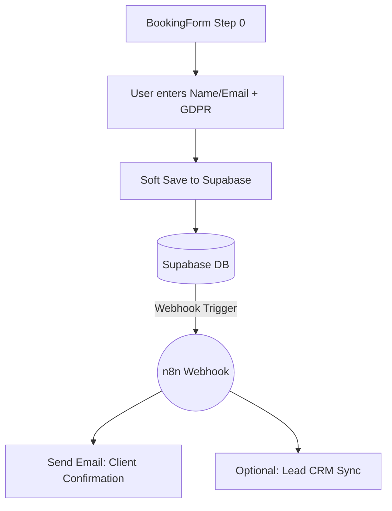

# N8N & GDPR Integration: Implementation Plan (v2)

> **Status**: DRAFT v2 — Updated per User Feedback
> **Purpose**: Implement a robust, "website-bypass" automation flow using Supabase Webhooks and ensure GDPR compliance.

---

## 1. Goal & Context

We are moving away from browser-side webhook calls. Instead, we will leverage **Supabase Webhooks** to trigger n8n automatically when lead data is saved. This ensures that even if the client's browser crashes or they close the tab, the automation persists.

Additionally, we will integrate **GDPR compliance** into the initial contact step to ensure all automated emails are legally compliant.

---

## 2. Updated Architecture (The "Bypass" Flow)

---

## 3. Key Technical Decisions

### 3.1 Trigger Point: The "Soft Save"
To meet the requirement of triggering "after the email is captured", we will implement a "Soft Save" at the end of **Step 0**.
- **Behavior**: As soon as the user clicks "Next" from Step 0, we save the lead.
- **Deduplication (Website-side)**: 
  - On the first "Next" click, we perform an `INSERT` and store the `supabaseBookingId`.
  - If the user goes back and clicks "Next" again, we perform an `UPSERT` (update) on the same ID.
- **Webhook Filter**: We will configure the Supabase Webhook to trigger **ONLY ON INSERT** for the automated "Welcome" email. This ensures the user only gets one email even if they update their contact info multiple times before finishing.

### 3.2 Security: Supabase Webhooks
- **Bypassing the Website**: The website does not call the webhook URL; Supabase does this server-side.
- **Trigger Condition**: `INSERT` into `bookings` where `status = 'lead'`.

### 3.3 GDPR Compliance
- **The Form**: A mandatory checkbox in Step 0.
- **Standard Wording**: *"I consent to the collection and processing of my personal data for the purpose of scheduling a tattoo appointment and receiving project-related communications. (Privacy Policy)"*
- **The Database**: A new column `gdpr_consented` (boolean) will be added.

---

## 4. Proposed Changes

### Component: Database (Supabase)
#### [MODIFY] `bookings` Table
- [NEW] Column: `gdpr_consented` (boolean, default: false).
- [MIGRATION] Add SQL script to update the schema and configure the Webhook.

### Component: Frontend (React)
#### [MODIFY] [BookingForm.tsx](file:///c:/Users/patsi/OneDrive/%CE%A5%CF%80%CE%BF%CE%BB%CE%BF%CE%B3%CE%B9%CF%83%CF%84%CE%AE%CF%82/GitHub%20repos/tattoo-studio-booking-prototype/tattoo-studio-booking-prototype/src/components/BookingForm.tsx)
- Add GDPR checkbox to Step 0.
- Implement "Soft Save" logic when moving from Step 0 to Step 1.

#### [MODIFY] [useBookingSubmit.ts](file:///c:/Users/patsi/OneDrive/%CE%A5%CF%80%CE%BF%CE%BB%CE%BF%CE%B3%CE%B9%CF%83%CF%84%CE%AE%CF%82/GitHub%20repos/tattoo-studio-booking-prototype/tattoo-studio-booking-prototype/src/hooks/useBookingSubmit.ts)
- Add a new `softSave` method or update `handleSave` to support incremental updates.

---

## 5. Implementation Roadmap

### Phase 1: Preparation (GDPR & Schema)
- [ ] **Migration**: Add `gdpr_consented` column to `bookings`.
- [ ] **I18n**: Add standard GDPR text keys to `en.ts` and `el.ts`.

### Phase 2: Frontend "Soft Save"
- [ ] Update `BookingForm.tsx` Step 0 with the GDPR checkbox.
- [ ] Update `useBookingSubmit.ts` with `softSave` logic (INSERT on first hit, UPSERT on subsequent hits).

### Phase 3: Webhook Configuration
- [ ] Configure Supabase Webhook to trigger on `INSERT` into `bookings`.
- [ ] (Manual) User must provide the n8n Webhook URL to be set in Supabase.

---

## 6. Verification Plan

### Automated Tests
- [ ] `useBookingSubmit` handles `softSave` without creating duplicate records.
- [ ] Validation prevents Step 0 submission without GDPR consent.

### Manual Verification
1. Fill Step 0, click Next. Verify record appears in Supabase with `status: lead`.
2. Go back, change name, click Next. Verify *same* record is updated (no new row).
3. Check n8n dashboard for a single incoming webhook.

---

> **Last Updated**: 2026-03-16 (v2)
